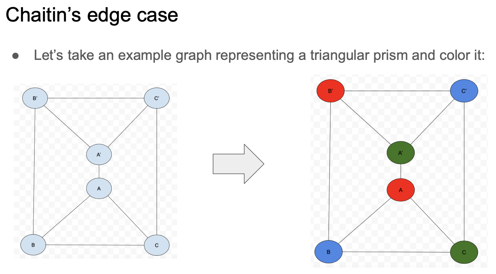
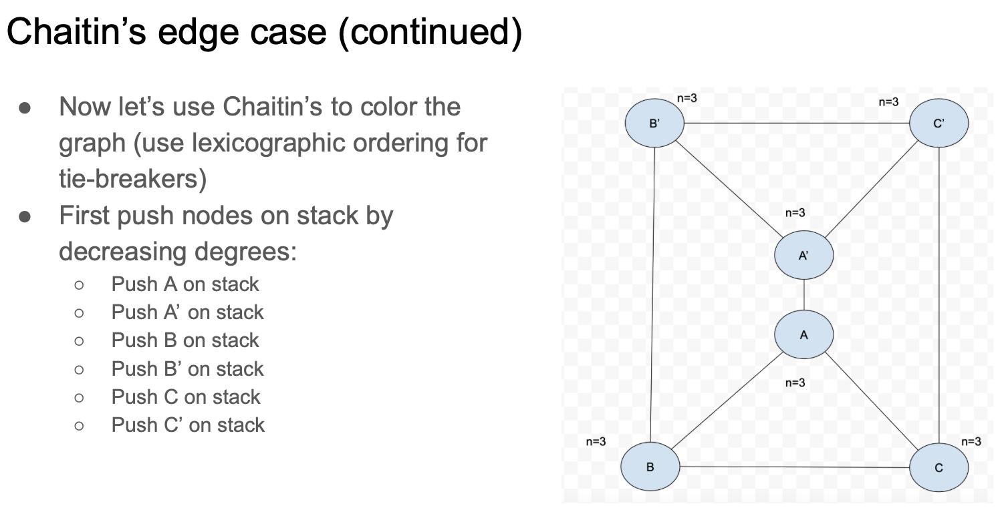
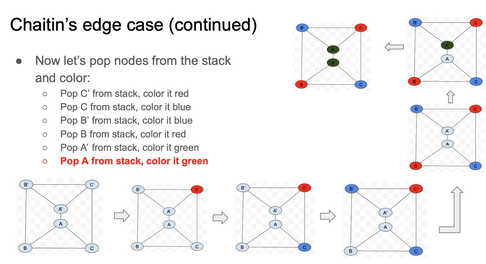

# Graph Coloring Heuristic Algorithm Project - CS255

by Manav Bhasin, Kush Patel, and Pawan Sarma

## Background
The graph coloring problem is a known NP-complete problem where the goal is to color each vertex in a graph such that no two adjacent nodes have the same color. It is also known that the minimum number of colors to reach such a configuration is **four**. Many algorithms exist today to find such a configuration using the four colors. The two we analyzed are backtracking (brute force) and Chaitin's algorithm. Upon reviewing these algorithms we set out to improve them.

## Existing Algorithms

### Backtracking
The brute force solution is just traversing the entire graph tree until a valid configuration is found or the entire tree has been traversed. The runtime is O($m^v$) and although the algorithm finds the optimal solution, it is time consuming.

### Chaitin's Algorithm
Chaitin's algorithm is a heuristic algorithm that uses two phases, a simplification phase and a selection phase, to come up with a valid ocnfiguration. The simplification phase entails pushing the node with the lowest degree onto a stack and removing the node (and its edges from the graph). This process is repeated till the graph is empty. The selection phase involves popping nodes from the stack one by one. For each node, the node is assigned a color that's different from its neighbors. The algorithm may produce a suboptimal solution, but runs in O(V+E) time, which is much faster than backtracking.

For all cases, Chaitin's procedues a solution, although it may be suboptimal. However in one specific edge case, Chaitin's algorithm fails to produce *any solution*, despite a valid configuration existing. The edge case is described below:

A valid configuration for the graph

The simplification phase

The selection phase

## Our proposed algorithm - Penalty Score Heuristic (PSH)
Our proposed algorithm, PSH, combines beam search with heuristinc functions. The algorithm executes a BFS on the original graph, while maintaining a **fixed-width beam of k partial colorings at each step**. At each level of the graph, the algorithm calculates a score for each node using a heuristic function and only traversing the top *k* nodes. The heuristic function takes into account the number of conflicts a node could have with its neighbors, the degrees for the node, and more. 

